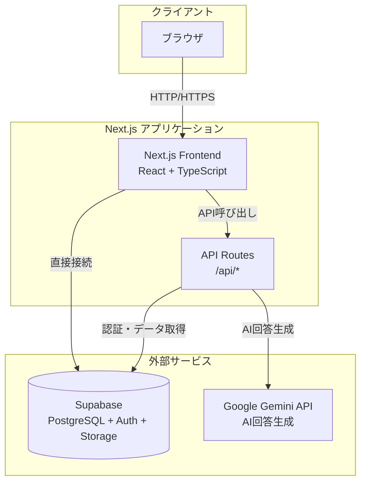
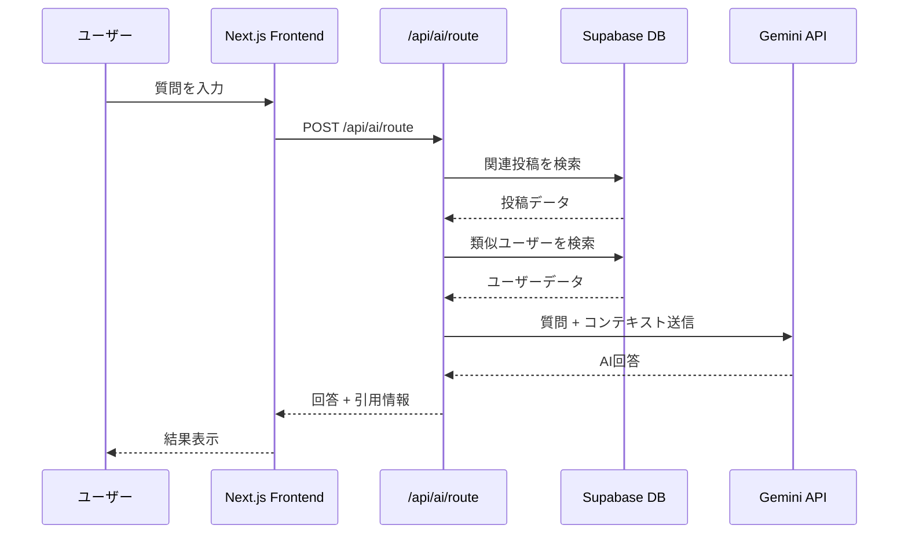

# システムアーキテクチャ図

## 全体構成

## 主要コンポーネント

### フロントエンド
- **Next.js 14** (App Router)
- **React 18** + **TypeScript**
- **Tailwind CSS**

### バックエンド
- **Next.js API Routes**
  - `/api/ai/*` - AI機能
  - `/api/auth/*` - 認証
  - `/api/posts/*` - 投稿検索
  - `/api/users/*` - ユーザー推薦

### データベース・認証
- **Supabase**
  - PostgreSQL データベース
  - 認証 (Email/Password, OAuth)
  - ストレージ (画像・ファイル)

### AI機能
- **Google Generative AI (Gemini)**
  - 質問回答生成
  - 投稿検索結果の要約

## データフロー例: AI質問回答

